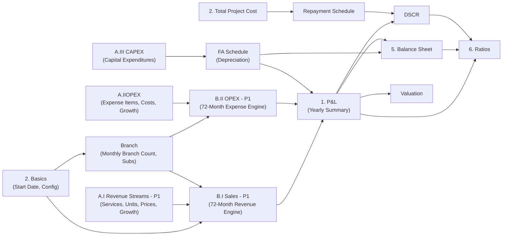

# Docty Healthcare — Complete Formula Extraction & Code Conversion

> **Source**: `Docty Healthcare - Business Plan.xlsx` (27 sheets, **109,868 formulas**)
> **Extracted via**: openpyxl with `data_only=False`

---

## Part 1: Raw Formula Audit

### Workbook Structure

| Sheet | Rows × Cols | Formulas | Purpose |
|-------|-------------|----------|---------|
| `A.I Revenue Streams - P1` | 203×35 | 87 | Revenue input: services, units, prices, growth rates |
| `A.IIOPEX` | 86×21 | 33 | OPEX input: expense categories, costs, growth rates |
| `A.III CAPEX` | 42×10 | 17 | Capital expenditure schedule |
| `Branch` | 74×18 | 421 | Monthly branch expansion + subscription trajectories |
| `B.I Sales - P1` | 244×320 | 40,925 | **Core revenue engine** — 72-month service-level revenue |
| `B.I Sales - P1 (2)` | 244×320 | 40,984 | Revenue engine (yearly aggregation copy) |
| `B.II OPEX - P1` | 100×320 | 14,130 | **Core expense engine** — 72-month expense computation |
| `B.II - OPEX` | 168×67 | 3,346 | OPEX computation (alternate layout) |
| `1. P&L` | 50×18 | 175 | **Profit & Loss summary** — yearly aggregation |
| `1. P&L (Only CR)` | 48×18 | 153 | P&L (clinical revenue only) |
| `2. Basics` | 24×5 | 1 | Company info, start date, base config |
| `2.Total Project Cost` | 11×8 | 4 | Project funding structure |
| `5. Balance sheet` | 43×16 | 247 | Balance sheet projections |
| `6. Ratios` | 28×8 | 102 | Financial ratios (ROE, DSCR, etc.) |
| `FA Schedule` | 18×23 | 129 | Fixed asset depreciation schedule |
| `DSCR` | 19×7 | 49 | Debt Service Coverage Ratio |
| `Repayment schedule` | 89×14 | 360 | Loan repayment amortization |
| `Valuation` | 69×8 | 121 | DCF/NPV company valuation |
| `Phase 1` / `Phase 2` | 93×8 / 100×6 | 424/423 | Phase breakdowns |

### Cross-Sheet Dependency Map



---

### Key Raw Formulas by Sheet

#### `B.I Sales - P1` — Revenue Engine (per-month columns, 72 months)

**Row 2 (Header) — Branch count & Growth factor per month:**
```
K2  = VLOOKUP(K5, Branch!$D$4:$E$74, 2, 0)     → Branches for this month
L2  = Branch!F4                                   → Growth rate for month 1
P2  = 1+(L2*45%)                                  → Price adjustment factor
T2  = 1+Branch!F6                                 → Compounded growth factor
```

**Row 10 (First service — Root Canal):**
```
E10 = 'A.I Revenue Streams - P1'!F10              → Base units/month (=8)
H10 = 'A.I Revenue Streams - P1'!J10              → Growth % (=25%)
I10 = G10 * H10                                   → Month 1 revenue = Qty × Price

K10 = 'A.I Revenue Streams - P1'!H10 * K$2 * L$2  → Qty = BaseUnits × Branches × GrowthFactor
L10 = H10 * $L$8                                   → Price = BasePrice × PriceGrowthFactor
M10 = K10 * L10                                    → Revenue = Qty × Price

O10 = K10 * O$8 * O$2/K$2 * P$2                   → Next month: PrevQty × MonthlyGrowth × BranchRatio × PriceAdj
P10 = L10 * P$8                                    → Next month price with growth
Q10 = O10 * P10                                    → Next month revenue

S10 = O10 * S$8 * S$2/O$2 * T$2                   → Pattern continues for all 72 months...
```

**Summary rows (revenue totals by stream):**
```
Row 68:  = SUM(rows 10:67)     → Clinical Revenue total
Row 78:  = SUM(rows 72:76)     → Docty Pharma total
Row 175: = SUM(rows 82:174)    → Lab & Diagnostics total
Row 182: = SUM(rows 179:181)   → Workplace Wellness total
Row 192: = SUM(rows 186:191)   → Other Services total
Row 205: = SUM(rows 195:204)   → Marketplace total
Row 207: = Row68 + Row78 + Row175 + Row182 + Row192 + Row205  → GRAND TOTAL
Row 212: = Row207 * 12         → Yearly Revenue
```

#### `A.I Revenue Streams - P1` — Revenue Input Data

**Units calculation (Col H = adjusted units × branches):**
```
H7  = 1                                            → Number of branches
H10 = 2*4*H7      → Root Canal: 8 units/branch
H11 = 2*4*H7      → Teeth Extraction: 8 units/branch  
H13 = 2*H7        → Implant: 2 units/branch
H14 = 10*30*H7    → X Ray: 300 units/branch
H31 = 20*30*H7    → Consultation: 600/branch
H70 = 30*30*H7    → Ethical Drugs: 900/branch
H71 = 50*30*H7    → Generic Drugs: 1500/branch
```

#### `A.IIOPEX` — OPEX Input Data

```
I8  = 1                         → Branches multiplier
I11 = 295000 * I8               → Rent = ₹295,000 × branches
I22 = 200000 * I8               → Management salary = ₹200,000 × branches
I23 = 150000 * I8               → Doctors salary = ₹150,000 × branches
I31 = 30000 * I8                → Housekeeping = ₹30,000 × branches
I34 = 200000 * I8               → Lab Aggregators = ₹200,000 × branches
I50 = 200000 * I8               → Management Fee = ₹200,000 × branches
I66 = 130000/12                 → Lease Registration = ₹10,833/mo (annual/12)
I67 = 145000/12/5               → Drug Licenses = ₹2,417/mo (annual/12/5yr validity)
```

#### `B.II - OPEX` — OPEX Computation Engine

```
H10 = F10 * G10                 → Base cost = Units × UnitCost
J10 = F10 * $J$8                → Growth: Units × MonthlyGrowthFactor
K10 = G10 * $K$8                → Growth: Price × MonthlyGrowthFactor  
L10 = J10 * K10                 → Month cost = GrownUnits × GrownPrice
N10 = J10 * $N$8                → Next period units growth
O10 = K10 * $O$8                → Next period price growth
P10 = N10 * O10                 → Next period cost
... (pattern repeats for 72 months)

AQ10 = SUMIF($F$6:$AN$6, AQ$6, F10:AN10)  → Yearly aggregation via SUMIF
```

#### `1. P&L` — Profit & Loss Statement

```
Revenue:
  B11 = 'B.I Sales - P1 (2)'!KK68    → Clinical Revenue (Y1)
  B12 = 'B.I Sales - P1 (2)'!KK78    → Docty Pharma (Y1)
  B13 = 'B.I Sales - P1 (2)'!KK175   → Lab & Diagnostics (Y1)
  B14 = 'B.I Sales - P1 (2)'!KK182   → Workplace Wellness (Y1)
  B15 = 'B.I Sales - P1 (2)'!KK192   → Other Services (Y1)
  B16 = 'B.I Sales - P1 (2)'!KK205   → Marketplace (Y1)
  B17 = SUM(B11:B16)                  → Total Revenue (Y1)
  
OPEX:
  B21 = 'B.II OPEX - P1'!KJ17        → Utilities (Y1)
  B22 = 'B.II OPEX - P1'!KJ28        → Salaries (Y1)
  B23 = 'B.II OPEX - P1'!KJ38        → Vendor Payments (Y1)
  B24 = 'B.II OPEX - P1'!KJ47        → Supplies (Y1)
  B25 = 'B.II OPEX - P1'!KJ55        → Payouts (Y1)
  B26 = 'B.II OPEX - P1'!KJ63        → Marketing & Promotions (Y1)
  B27 = 'B.II OPEX - P1'!KJ76        → Licenses & Registration (Y1)
  B28 = 'B.II OPEX - P1'!KJ87        → Supplies (Additional) (Y1)
  B30 = SUM(B21:B29)                  → Total OPEX (Y1)

EBITDA:
  B33 = B17 - B30                     → EBITDA = Revenue - OPEX
  B34 = B33 / B17                     → EBITDA Margin %

PBT (before depreciation):
  B36 = B33 - SUM(B35:B35)            → PBT = EBITDA - Other Expenses

Depreciation:
  B38 = 'FA Schedule'!F17             → Depreciation from Fixed Asset Schedule

PAT:
  B39 = B36 - B38                     → Profit Before Tax = PBT - Depreciation
  B42 = IF(B39>0, B39*25.17%, 0)      → Tax @ 25.17%
  B43 = B39 - B42                     → NET PROFIT (PAT) = PBT - Tax
  
Growth:
  D18 = D17/C17 - 1                   → Revenue growth Y/Y
  D44 = D43/D17 * 100                 → PAT margin %
```

#### `Branch` — Branch Expansion Schedule

```
D3  = EOMONTH('2. Basics'!$D$16, 1)                → First month date
D4  = EOMONTH($D$3, B4)                             → Subsequent month dates
C3  = IF(MONTH(D3)<=3, TEXT(...)...)                 → Financial year label
G5  = E5 - E4                                       → New branches added
M10 = J10                                            → Cumulative marketplace subs
N10 = K10                                            → Cumulative retail subs
O10 = L10                                            → Cumulative corporate subs
```

Full raw audit: see `info/raw_formulas.json` (109,868 entries) and `info/raw_formula_audit.txt`

---

## Part 2: Clean Business Logic

### Revenue Engine

```
FOR each month M (1 to 72):
  branches[M] = lookup from Branch Schedule
  growthFactor[M] = 1 + Branch.growthRate[M]

FOR each service S:
  baseUnits[S]  = from Revenue Streams sheet
  basePrice[S]  = from Revenue Streams sheet
  
  # Month 1 (launch month):
  qty[S,1]     = baseUnits[S] × branches[1]
  price[S,1]   = basePrice[S]
  revenue[S,1] = qty[S,1] × price[S,1]
  
  # Months 2+:
  qty[S,M]     = qty[S,M-1] × monthlyGrowth[M] × (branches[M] / branches[M-1]) × priceAdj[M]
  price[S,M]   = price[S,M-1] × priceGrowth[M]
  revenue[S,M] = qty[S,M] × price[S,M]

STREAM TOTALS:
  clinicalRevenue[M]     = SUM(revenue[S,M]) for S in Clinical services (rows 10-67)
  pharmaRevenue[M]       = SUM(revenue[S,M]) for S in Pharma (rows 72-76)
  labRevenue[M]          = SUM(revenue[S,M]) for S in Lab (rows 82-174)
  wellnessRevenue[M]     = SUM(revenue[S,M]) for S in Wellness (rows 179-181)
  otherRevenue[M]        = SUM(revenue[S,M]) for S in Other (rows 186-191)
  marketplaceRevenue[M]  = SUM(revenue[S,M]) for S in Marketplace (rows 195-204)
  
  TOTAL_REVENUE[M] = clinical + pharma + lab + wellness + other + marketplace

YEARLY:
  YEARLY_REVENUE[Y] = SUM(TOTAL_REVENUE[M]) for M in year Y (12 months)
```

### OPEX Engine

```
FOR each month M (1 to 72):
  branches[M] = from Branch Schedule

FOR each expense E:
  baseCost[E]     = from OPEX input sheet
  perBranch[E]    = true/false (most expenses are per-branch)
  
  # Month 1:
  cost[E,1] = baseCost[E] × (perBranch[E] ? branches[1] : 1)
  
  # Months 2+:
  unitGrowth[E,M]  = prevUnits × growthFactor[M]
  priceGrowth[E,M] = prevPrice × priceGrowthFactor[M]
  cost[E,M]        = unitGrowth[E,M] × priceGrowth[E,M]

CATEGORY TOTALS:
  utilities[M]     = SUM(cost[E,M]) for E in {Rent, Electricity, Internet, Maint, Petty}
  salaries[M]      = SUM(cost[E,M]) for E in {Mgmt, Doctors, Clinical, Admin, Other}
  vendors[M]       = SUM(cost[E,M]) for E in {Housekeeping, Pest, Biomedical, Lab Agg}
  supplies[M]      = SUM(cost[E,M]) for E in {Housekeeping, Clinical, Pantry, Admin}
  payouts[M]       = SUM(cost[E,M]) for E in {Mgmt Fee, Franchisee, Consulting}
  marketing[M]     = SUM(cost[E,M]) for E in {Leaflet, Camps, Promotions, Media}
  licenses[M]      = SUM(cost[E,M]) for E in {Lease, Drug, Clinical Est, ...}
  supplies2[M]     = SUM(cost[E,M]) for E in {Pharmacy, Surgicals, Housekeeping}
  
  TOTAL_OPEX[M] = SUM of all category totals
  
YEARLY:
  YEARLY_OPEX[Y] = SUM(TOTAL_OPEX[M]) for M in year Y
```

### P&L Engine

```
FOR each year Y (1 to 6):
  REVENUE[Y]     = YEARLY_REVENUE[Y]
  OPEX[Y]        = YEARLY_OPEX[Y]
  EBITDA[Y]      = REVENUE[Y] - OPEX[Y]
  EBITDA_MARGIN   = EBITDA[Y] / REVENUE[Y]
  DEPRECIATION[Y] = from FA Schedule
  PBT[Y]         = EBITDA[Y] - DEPRECIATION[Y]
  TAX[Y]         = IF(PBT > 0, PBT × 25.17%, 0)
  PAT[Y]         = PBT[Y] - TAX[Y]                   // Net Profit After Tax
  PAT_MARGIN     = PAT[Y] / REVENUE[Y] × 100
```

### Growth Rate Structure

**Revenue Growth (from `A.I Revenue Streams - P1`):**

| Period | Monthly Growth | Applied To |
|--------|---------------|------------|
| Y1 (months 1-7) | Ramp-up per branch schedule | Units scale with new branches |
| Y2 (months 8-19) | 25% monthly | Quantity compound monthly |
| Y2→Y3 | 20% yearly | Quantity step-up |
| Y3→Y4 | 10% yearly | Quantity step-up |
| Y4→Y5 | 10% yearly | Quantity step-up |
| Y5→Y6 | 15% yearly | Quantity step-up |
| Y6→Y7 | 1% yearly | Quantity step-up |

**OPEX Growth (from `A.IIOPEX`):**

| Category | Y1 Monthly | Y1→Y2 | Y2→Y3 | Y3→Y4 | Y4→Y5 | Y5→Y6 |
|----------|-----------|-------|-------|-------|-------|-------|
| Utilities, Salaries, Vendors, Supplies, Payouts | 100% | 1% | 1% | 1% | 1% | 1% |
| Marketing & Promotions | 100% | 1% | 45% | 40% | 25% | 15% |
| Licenses & Registration | 100% | 75% | 45% | 40% | 25% | 15% |

---

## Part 3: Code Conversion (JavaScript/Node.js)

### `engine/branchSchedule.js`

```javascript
/**
 * Branch expansion schedule — drives both Revenue and OPEX scaling
 * Source: Branch sheet, rows 3-74
 */
const BRANCH_SCHEDULE = [
  // { month: 0-indexed, fy: 'YYYY-YY', date: 'Mon-YY', branches: N, growth: %, newBranches: N,
  //   subsMarketplace: N, subsRetail: N, subsCorporate: N,
  //   cumMarketplace: N, cumRetail: N, cumCorporate: N }
  { month: 0,  fy: '2025-26', branches: 1,  growth: 0,    newBranches: 1 },
  { month: 1,  fy: '2025-26', branches: 3,  growth: 0.15, newBranches: 2 },
  { month: 2,  fy: '2025-26', branches: 3,  growth: 0.15, newBranches: 0 },
  { month: 3,  fy: '2025-26', branches: 4,  growth: 0.10, newBranches: 1 },
  { month: 4,  fy: '2025-26', branches: 5,  growth: 0.25, newBranches: 1 },
  { month: 5,  fy: '2025-26', branches: 8,  growth: 0.30, newBranches: 3 },
  { month: 6,  fy: '2025-26', branches: 10, growth: 0.20, newBranches: 2 },
  // Y2 onwards: 10 branches steady
  // ... months 7-71 all have branches: 10
];

function getBranches(monthIndex) {
  if (monthIndex < BRANCH_SCHEDULE.length) {
    return BRANCH_SCHEDULE[monthIndex].branches;
  }
  return 10; // steady state
}

function getGrowthFactor(monthIndex) {
  if (monthIndex < BRANCH_SCHEDULE.length) {
    return 1 + BRANCH_SCHEDULE[monthIndex].growth;
  }
  return 1; // no growth in steady state
}

module.exports = { BRANCH_SCHEDULE, getBranches, getGrowthFactor };
```

### `engine/revenueEngine.js`

```javascript
/**
 * Revenue computation engine
 * Mirrors: B.I Sales - P1 (40,925 formulas)
 * 
 * Core formula per cell:
 *   K10 = BaseUnits × Branches × GrowthFactor
 *   L10 = BasePrice × PriceGrowthFactor
 *   M10 = K10 × L10 (Revenue = Qty × Price)
 *   
 *   O10 = K10 × MonthlyGrowth × (NextBranches/PrevBranches) × PriceAdj
 */

const REVENUE_GROWTH_RATES = {
  monthlyY2: 0.25,        // 25% monthly growth during Y2
  yearlyGrowth: [
    { from: 'Y2', to: 'Y3', rate: 0.20 },
    { from: 'Y3', to: 'Y4', rate: 0.10 },
    { from: 'Y4', to: 'Y5', rate: 0.10 },
    { from: 'Y5', to: 'Y6', rate: 0.15 },
    { from: 'Y6', to: 'Y7', rate: 0.01 },
  ]
};

/**
 * Compute monthly revenue for a single service across 72 months
 * @param {Object} service - { baseUnits, unitPrice, active }
 * @param {Function} getBranches - (monthIndex) => branchCount
 * @param {Function} getGrowthFactor - (monthIndex) => 1+growthRate
 * @returns {Array<{month, quantity, price, revenue}>}
 */
function computeServiceRevenue(service, getBranches, getGrowthFactor, months = 72) {
  const results = [];
  let prevQty = 0;
  let prevPrice = service.unitPrice;
  let prevBranches = 0;

  for (let m = 0; m < months; m++) {
    const branches = getBranches(m);
    const growthFactor = getGrowthFactor(m);
    let qty, price;

    if (m === 0) {
      // Month 1: K10 = BaseUnits × Branches × GrowthFactor
      qty = service.baseUnits * branches * growthFactor;
      price = service.unitPrice;
    } else {
      // Month N: O10 = PrevQty × MonthlyGrowth × (Branches[N] / Branches[N-1]) × PriceAdj
      const branchRatio = prevBranches > 0 ? branches / prevBranches : 1;
      
      // Determine which growth rate applies
      const yearIndex = Math.floor(m / 12);
      let monthlyGrowth = 1;
      let priceGrowth = 1;
      
      if (yearIndex === 0) {
        // Y1: growth driven by branch expansion only
        monthlyGrowth = growthFactor;
        priceGrowth = 1;
      } else if (yearIndex === 1) {
        // Y2: 25% monthly compound growth
        monthlyGrowth = 1 + REVENUE_GROWTH_RATES.monthlyY2;
      } else {
        // Y3+: yearly growth applied as monthly factor
        const yrGrowth = REVENUE_GROWTH_RATES.yearlyGrowth[yearIndex - 2];
        const rate = yrGrowth ? yrGrowth.rate : 0;
        // Applied yearly but computed monthly
        if (m % 12 === 0) {
          monthlyGrowth = 1 + rate;
        }
      }
      
      qty = prevQty * monthlyGrowth * branchRatio;
      price = prevPrice * priceGrowth;
    }

    const revenue = qty * price;
    results.push({ month: m, quantity: qty, price, revenue });
    
    prevQty = qty;
    prevPrice = price;
    prevBranches = branches;
  }

  return results;
}

/**
 * Compute total revenue across all services for all months
 */
function computeAllRevenue(services, getBranches, getGrowthFactor) {
  const streams = {};
  
  for (const service of services) {
    if (!service.active) continue;
    
    const monthlyData = computeServiceRevenue(service, getBranches, getGrowthFactor);
    
    if (!streams[service.streamName]) {
      streams[service.streamName] = { services: [], monthlyTotal: new Array(72).fill(0) };
    }
    
    streams[service.streamName].services.push({
      name: service.name,
      monthly: monthlyData
    });
    
    monthlyData.forEach((d, i) => {
      streams[service.streamName].monthlyTotal[i] += d.revenue;
    });
  }
  
  // Grand total (row 207)
  const grandTotal = new Array(72).fill(0);
  for (const stream of Object.values(streams)) {
    stream.monthlyTotal.forEach((v, i) => grandTotal[i] += v);
  }
  
  // Yearly aggregation (row 212)
  const yearlyRevenue = [];
  for (let y = 0; y < 6; y++) {
    const start = y * 12;
    const yearTotal = grandTotal.slice(start, start + 12).reduce((a, b) => a + b, 0);
    yearlyRevenue.push(yearTotal);
  }
  
  return { streams, grandTotal, yearlyRevenue };
}

module.exports = { computeServiceRevenue, computeAllRevenue, REVENUE_GROWTH_RATES };
```

### `engine/opexEngine.js`

```javascript
/**
 * OPEX computation engine
 * Mirrors: B.II OPEX - P1 (14,130 formulas) + B.II - OPEX (3,346 formulas)
 * 
 * Core formula:
 *   cost[E,M] = baseCost × branches × unitGrowth × priceGrowth
 *   
 * Growth patterns:
 *   - Categories 1-5: 1% annual inflation
 *   - Categories 6-7: Variable (45%, 40%, 25%, 15% declining)
 */

const OPEX_GROWTH_RATES = {
  stable: { // Utilities, Salaries, Vendors, Supplies, Payouts
    y1Monthly: 1.0,
    yearly: [0.01, 0.01, 0.01, 0.01, 0.01]  // Y1→Y2 through Y5→Y6
  },
  declining: { // Marketing, Licenses
    y1Monthly: 1.0,
    yearly: [0.01, 0.45, 0.40, 0.25, 0.15]   // Y1→Y2 through Y5→Y6
  }
};

/**
 * Compute monthly expense for a single item across 72 months
 * @param {Object} expense - { baseCost, perBranch, category, active }
 * @param {Function} getBranches - (monthIndex) => branchCount
 * @returns {Array<{month, cost}>}
 */
function computeExpense(expense, getBranches, months = 72) {
  const results = [];
  const growthProfile = ['Marketing & Promotions', 'Licenses & Registration']
    .includes(expense.category) ? OPEX_GROWTH_RATES.declining : OPEX_GROWTH_RATES.stable;
  
  let prevCost = expense.baseCost;

  for (let m = 0; m < months; m++) {
    const branches = getBranches(m);
    
    let cost;
    if (m === 0) {
      cost = expense.perBranch ? expense.baseCost * branches : expense.baseCost;
    } else {
      // Apply growth at year boundaries
      const yearIndex = Math.floor(m / 12);
      const prevYearIndex = Math.floor((m - 1) / 12);
      
      if (yearIndex > prevYearIndex && yearIndex - 1 < growthProfile.yearly.length) {
        const yearlyRate = growthProfile.yearly[yearIndex - 1];
        prevCost = prevCost * (1 + yearlyRate);
      }
      
      cost = expense.perBranch ? prevCost * branches : prevCost;
    }
    
    results.push({ month: m, cost });
    if (!expense.perBranch) prevCost = cost;
  }

  return results;
}

/**
 * Compute total OPEX across all categories for all months
 */
function computeAllOpex(expenses, getBranches) {
  const categories = {};
  
  for (const expense of expenses) {
    if (!expense.active) continue;
    
    const monthlyData = computeExpense(expense, getBranches);
    
    if (!categories[expense.category]) {
      categories[expense.category] = { items: [], monthlyTotal: new Array(72).fill(0) };
    }
    
    categories[expense.category].items.push({
      name: expense.name,
      monthly: monthlyData
    });
    
    monthlyData.forEach((d, i) => {
      categories[expense.category].monthlyTotal[i] += d.cost;
    });
  }
  
  // Grand total OPEX
  const grandTotal = new Array(72).fill(0);
  for (const cat of Object.values(categories)) {
    cat.monthlyTotal.forEach((v, i) => grandTotal[i] += v);
  }
  
  // Yearly aggregation
  const yearlyOpex = [];
  for (let y = 0; y < 6; y++) {
    const start = y * 12;
    const yearTotal = grandTotal.slice(start, start + 12).reduce((a, b) => a + b, 0);
    yearlyOpex.push(yearTotal);
  }
  
  return { categories, grandTotal, yearlyOpex };
}

module.exports = { computeExpense, computeAllOpex, OPEX_GROWTH_RATES };
```

### `engine/pnlEngine.js`

```javascript
/**
 * P&L Engine — mirrors '1. P&L' sheet (175 formulas)
 * 
 * Row mapping:
 *   11-16: Revenue by stream (from B.I Sales yearly totals)
 *   17:    Total Revenue = SUM(11:16)
 *   21-28: OPEX by category (from B.II OPEX yearly totals)
 *   30:    Total OPEX = SUM(21:29)
 *   33:    EBITDA = Revenue - OPEX
 *   34:    EBITDA Margin = EBITDA / Revenue
 *   38:    Depreciation (from FA Schedule)
 *   39:    PBT = EBITDA - Depreciation
 *   42:    Tax = IF(PBT > 0, PBT × 25.17%, 0)
 *   43:    PAT = PBT - Tax
 *   44:    PAT Margin = PAT / Revenue × 100
 */

const TAX_RATE = 0.2517; // 25.17% corporate tax

function computePnL(yearlyRevenue, yearlyOpex, yearlyDepreciation = [0,0,0,0,0,0]) {
  const years = Math.min(yearlyRevenue.length, yearlyOpex.length);
  const pnl = [];

  for (let y = 0; y < years; y++) {
    const revenue = yearlyRevenue[y];
    const opex = yearlyOpex[y];
    const ebitda = revenue - opex;
    const ebitdaMargin = revenue > 0 ? ebitda / revenue : 0;
    const depreciation = yearlyDepreciation[y] || 0;
    const pbt = ebitda - depreciation;
    const tax = pbt > 0 ? pbt * TAX_RATE : 0;
    const pat = pbt - tax;
    const patMargin = revenue > 0 ? (pat / revenue) * 100 : 0;
    const revenueGrowth = y > 0 && yearlyRevenue[y-1] > 0 
      ? (revenue / yearlyRevenue[y-1]) - 1 
      : 0;

    pnl.push({
      year: y + 1,
      fy: `Y${y + 1}`,
      revenue,
      opex,
      ebitda,
      ebitdaMargin,
      depreciation,
      pbt,
      tax,
      pat,
      patMargin,
      revenueGrowth
    });
  }

  return pnl;
}

module.exports = { computePnL, TAX_RATE };
```
